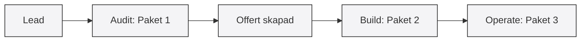

# Offer — Vad vi säljer

> [!note] Erbjudande
> Tre paket som kunden kan köpa. Enkelt, tydligt, värdedrivet.
> Senast uppdaterad: 2026-06-24

## Paket 1: Audit — "Kartläggningen"

**Pris: 19 900 kr (fast)** (se [[PRICING_MODEL]])

Kunden får:
- Full kartläggning av IT-flöden (1-2 dagar) (se [[ONBOARDING]])
- Rapport med 5-10 automation opportunities (se [[AUDIT_TEMPLATE]])
- ROI-kalkyl per opportunity
- Prioriteringsordning baserat på impact vs effort
- Offert för Paket 2 (om kunden vill gå vidare) (se [[OFFERT_TEMPLATE]])

Signal till kund: "Vi förstår er verksamhet innan vi föreslår något."

## Paket 2: Build — "Agent-systemet"

**Pris: från 99 000 kr (offereras efter audit)** (se [[PRICING_MODEL]])

Kunden får:
- 3-5 AI-agenter som automatiserar deras flöden (se [[AGENT_FRAMEWORK]])
- Dashboard där deras personal hanterar agenterna (se [[DASHBOARD_SPEC]])
- Integration mot deras befintliga system
- 2h utbildning för personalen
- 30 dagars driftsupport

Signal till kund: "Ni får ett system, inte en rapport."

## Paket 3: Operate — "Löpande drift"

**Pris: från 9 900 kr/mån** (se [[SUBSCRIPTION_TIERS]])

Kunden får:
- Allt i Paket 2 underhålls och uppdateras
- Nya agenter löpande (2-4 per år)
- Prioriterad support
- Dashboard-uppdateringar
- Månadsmöte: "vad har agenterna gjort denna månad?"

Signal till kund: "Vi sköter allt. Ni använder bara."

## Försäljningsflöde

Alternativ: Sälj Paket 2+3 direkt om kunden är självklar (större företag med tydligt behov). Men ALDRIG sälj Paket 3 utan Paket 2 först.

## Rabattlogik

- Paket 1 + 2 i samma köp: 10% på Paket 2
- Paket 2 + 3 i samma köp: första 3 mån subscription gratis
- Alla tre: 15% på Paket 2 + första 6 månader subscription halva priset
- Referensrabatt: kunden som hänvisar nästa får 1 månads subscription gratis

## Kommentarer

- 2026-06-24 | william: skapad
- 2026-06-24 | hermes: Länkat till prismodell, templates, onboarding, och lagt till Mermaid säljflöde.
