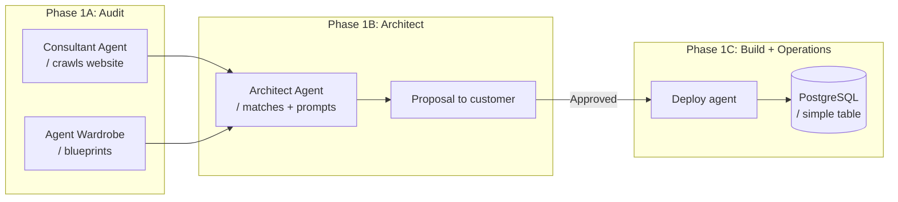
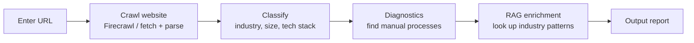

# Implementation Plan: Phase 1 — From audit to first agent

> [!info] Prioritization
> Build customer value first, infrastructure when it hurts.
> Flow: **Consultant Agent → Agent Wardrobe → Architect Agent → Proposal → Security → Dashboard**

---

## 1. Architecture Overview (MVP)



**No Redis. No Cloud Run. No queue.**
Phase 1 is a monolithic backend that does everything — we split up when needed.

---

## Phase 1A: Consultant Agent & Agent Wardrobe (1-2 weeks)

### Task 1A.1: Consultant Agent — Test audit

Build the agent that crawls a company website and produces an initial diagnosis.

**Path:** `apps/konsult-agent/`



**Steps:**

1. **Crawl** — Fetch sitemap + all subpages. Extract text per page.
   - Input: company URL
   - Output: array of `{ url, title, content }`
   - Implementation: Firecrawl API or simple `fetch` + `cheerio`/`jsdom`
   - *No complex web scraper — a Python script with requests + BeautifulSoup is enough for MVP*

2. **Classify** — LLM prompt that analyzes the content:
   - Industry (accounting, real estate, logistics, e-commerce, healthcare, etc.)
   - Size (employees, revenue — guess from pages like "About us", "Team")
   - Tech stack (is Shopify, Fortnox, Slack, Google Workspace mentioned?)
   - Maturity level (do they have IT systems? Manual processes?)

3. **Diagnostics** — LLM prompt that identifies bottlenecks:
   - Common questions (FAQ page → good candidate for customer service agent)
   - Repeated phrases in job ads ("manual handling", "administrative" → automation potential)
   - Processes mentioned (invoicing, bookkeeping, customer support, order management)

4. **RAG enrichment** — Look up industry-specific automation patterns from a simple knowledge base:
   - First version: a markdown file with industry patterns
   - Second version: Pinecone vector database

5. **Output report** — Structured YAML/JSON:
   ```yaml
   test_audit:
     company: "Example AB"
     url: "https://example.se"
     industry: "accounting"
     estimated_size: "10-20 employees"
     tech_stack: ["Fortnox", "Slack", "Google Workspace"]
     automation_potential:
       - process: "invoice management"
         signal: "About page mentions manual invoice handling"
         priority: 1
       - process: "customer support"
         signal: "FAQ with 40+ questions, no chat"
         priority: 2
       - process: "annual accounts"
         signal: "Advertises annual accounts service — likely manual"
         priority: 3
   ```

**Implementation:** Python script that takes a URL → does the above → saves report.
*No server needed. Can be run from CLI or simple Next.js page.*

### Task 1A.2: Agent Wardrobe — Blueprints

Create folder structure for reusable agent templates.

**Path:** `agent-blueprints/`

```yaml
agent-blueprints/
├── _INDEX.md                    ← Registry of all blueprints
├── customer-service-triage/
│   ├── blueprint.yaml           ← Metadata: name, cost, time savings, requirements
│   ├── prompt_template.md       ← Template that the Architect fills in
│   ├── tools.yaml               ← Tools the agent may use
│   └── tests/
│       ├── input.json
│       └── expected.json
├── invoice-reviewer/
│   ├── blueprint.yaml
│   ├── prompt_template.md
│   ├── tools.yaml
│   └── tests/
├── mail-sorter/
│   └── ...
└── report-writer/
    └── ...
```

**Blueprint metadata (blueprint.yaml):**
```yaml
name: invoice-reviewer
version: 1.0.0
category: finance
cost_per_month: 1900
time_savings_hours_per_week: 6-10
requirements:
  - fortnox-access (read)
  - email-access (read)
  - order-history (read-only)
security_level: medium
tone_of_voice_required: false
prompt_variables:
  - company_name
  - fortnox_api_key
  - approval_threshold_amount
```

**Prompt template (prompt_template.md):**
```markdown
# Assignment: {{company_name}} — {{blueprint.name}}

You are a {{blueprint.category}} expert employed by {{company_name}}.
{{blueprint.description}}

## Instructions
{{blueprint.instructions}}

## Tools
{{tools}}

## Security Rules
- You ONLY have access to {{company_name}}'s data
- Never execute transactions without approval
- Flag all deviations exceeding {{approval_threshold_amount}} SEK for manual review
```

**Steps:**
1. Create folder structure for 3 blueprints (customer-service-triage, invoice-reviewer, mail-sorter)
2. Create `blueprint.yaml` with metadata per blueprint
3. Create `prompt_template.md` with mustache variables (`{{variable}}`)
4. Create `tools.yaml` with available API tools
5. Register all in `agent-blueprints/_INDEX.md`

---

## Phase 1B: The Architect Agent (1 week)

### Task 1B.1: Architect — Connect audit → blueprints

Build the agent that takes a test audit and proposes agents.

**Path:** `apps/arkitekt/`

**Flow:**
1. Read the test audit report from the Consultant Agent
2. Read `agent-blueprints/_INDEX.md` for available blueprints
3. Match automation_potential from audit against blueprints
4. Generate proposal to customer

**Matching (LLM prompt):**
```
You are the Architect at styde.
Your task: match audit results against available agent blueprints.

Audit report:
{audit_yaml}

Available blueprints:
{blueprint_index}

For each automation_potential in the audit report:
1. Which blueprint(s) match?
2. Why?
3. Calculate cost (blueprint.cost_per_month)
4. Calculate time savings (blueprint.time_savings_hours_per_week)

Return JSON:
{
  "recommendations": [
    {
      blueprint: "invoice-reviewer",
      reason: "The company mentions manual invoice handling",
      cost: 1900,
      time_savings_hours: 8,
      priority: 1
    }
  ]
}
```

### Task 1B.2: Architect — Generate unique prompt

Create a custom prompt for each agent with:
- Company name, industry
- Tone-of-voice extracted from the website
- No internal references (sterile — customer must not see Hermes, ca-skills, etc.)

**Process:**
1. Read the blueprint's `prompt_template.md`
2. Extract tone-of-voice from the test audit's crawl data (LLM prompt: "Analyze the tone of this website — is it formal, personal, technical, friendly?")
3. Fill in mustache variables
4. Write to `agents/deployed/{customer_id}/{agent_id}/prompt.md`
5. Copy `tools.yaml` and fill in API keys (placeholder for now)

### Task 1B.3: Proposal to customer

The Architect builds a structured proposal:

```markdown
# Proposal for {company_name}

## Based on your analysis I recommend:

| Agent | Cost/month | Saves | Priority |
|-------|-------------|--------|-----------|
| Invoice-reviewer | 1,900 SEK | ~8 h/week | 1 |
| Customer-service-triage | 1,900 SEK | ~5 h/week | 2 |

**Total savings:** ~65,000 SEK/month in working time
**Total cost:** 3,800 SEK/month

## Next steps
1. Approve the proposal
2. We conduct a full audit
3. We build and deploy the agents
```

The proposal is saved as markdown in `agents/proposals/{customer_id}/` and displayed in the dashboard (when it exists).

---

## Phase 1C: Security & Data Isolation (parallel, 3 days)

### Task 1C.1: Data separation per customer

Security rules that apply to ALL code and ALL data:

| Mechanism | Implementation |
|-----------|---------------|
| **Customer ID in every call** | Every request has `x-styde-tenant` header |
| **Separate RAG indices** | Pinecone namespace = customer UUID |
| **Unique API keys** | One key per agent per customer, stored in environment variable/mount |
| **Isolated runtime** | Each agent runs in its own process/container |
| **Prompt injection protection** | Input sanitization. The agent cannot read outside its tenant |
| **Audit log** | All calls logged with tenant ID + agent ID + timestamp |

**In code (pseudo):**
```python
# Each agent gets its tenant at startup
class AgentContext:
    def __init__(self, tenant_id: str, encryption_key: str):
        self.tenant_id = tenant_id
        self.encryption_key = encryption_key
        self.pinecone_namespace = f"tenant_{tenant_id}"

    # Pinecone queries ALWAYS go through namespace
    def query_knowledge_base(self, query: str):
        return pinecone.query(
            namespace=self.pinecone_namespace,
            query=query
        )
```

**HARD-GATE:**
> An agent NEVER has access to more than ONE customer's data.
> No "super-admin" agents that can read all customers.
> Pinecone namespace and API key are set at deployment and cannot be changed by the agent.

---

## Phase 1D: Dashboard (minimal, 3 days)

No Redis. No BullMQ. Just a simple Next.js page that:

1. Lets William run a test audit (enter URL → view report)
2. Shows the Agent Wardrobe (which blueprints exist?)
3. Shows active agents per customer (if any)

**Path:** `apps/dashboard/` (Next.js App Router + Tailwind)

**Pages:**
- `/` — Home: run test audit or view latest
- `/wardrobe` — Browse blueprints
- `/customers` — List customers and their agents (empty until first customer)

**API (same Next.js, no Express):**
- `POST /api/audit` — Accept URL, run Consultant Agent, return report
- `GET /api/blueprints` — List agent blueprints
- `POST /api/agent/generate` — Take audit + selected blueprints, generate prompt + tools

---

## Timeline

| Phase | What | Time | Responsible |
|-----|-----|-----|----------|
| 1A.1 | Consultant Agent: crawl → classify → diagnostics → report | 4 days | William |
| 1A.2 | Agent Wardrobe: 3 blueprints + templates | 2 days | William |
| 1B.1 | Architect: match audit → blueprints | 2 days | William |
| 1B.2 | Architect: generate unique prompts from templates | 1 day | William |
| 1B.3 | Proposal to customer (markdown) | 1 day | William |
| 1C | Security: data isolation per customer | 3 days (parallel) | William |
| 1D | Dashboard: Next.js with audit + wardrobe + API | 3 days | William |
| **Total** | | **~12 working days** | |

**This gives:**
- Day 1-4: Can do test audits
- Day 5-6: Have blueprints to match against
- Day 7-10: Can generate agent proposals
- Day 11-12: Have a dashboard to display in

---

## Risks

| Risk | Impact | Mitigation |
|------|--------|------------|
| Consultant Agent produces poor audit reports | High | Iterate the prompt against 5 test websites. Manually verify each guess. |
| Too many blueprints too early | Medium | Start with 3. Add when patterns repeat across customers. |
| Prompt injection in customer text | High | All input from customer website is sanitized. Agent has HARD-GATE in its system prompt. |
| Security hole in data isolation | CRITICAL | Code review before first deploy. Each customer agent tested in isolated environment first. |

---

## Comments

- 2026-06-25 | hermes: Rewritten plan based on William & Hermes brainstorm. Prioritizes audit → architect → wardrobe before infrastructure.
- 2026-06-25 | hermes: Translated to English per new language policy.
