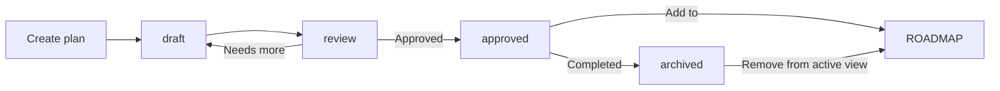

# _PLANNING_RULES — System for planning & follow-up

> [!important] Applies to EVERYONE who creates or modifies plans
> This system enables free planning without chaos.
> Each plan is its own file. Completed plans are collected in ROADMAP.
> Everything is logged. Nothing is forgotten.

---

## 1. Philosophy

| Principle | Explanation |
|---------|------------|
| **Free creation** | Anyone may create a new plan at any time. No approval required in advance. |
| **Traceability** | All changes are logged in the plan and in the daily log file. |
| **Collection** | Plans that reach `status: approved` or `status: archived` are added to ROADMAP. |
| **No drowning** | Old/bad plans are archived (`status: archived`) — NEVER deleted. |

---

## 2. Creating a new plan

### 2.1 When do I create a plan?

| Scenario | Example |
|----------|---------|
| A new feature needs to be built | "Build Consultant Agent" |
| A structural change | "OBSIDIAN → lowercase" |
| An idea that needs exploration | "Can we automate Fortnox?" |
| An audit or analysis | "Security review" |

> Always create a plan for things that take more than 30 minutes.
> For quick fixes (<30 min) a log entry is sufficient.

### 2.2 Template for new plan

Create a new file in `obsidian/01_plan/`:
```
obsidian/01_plan/{YYYY-MM-DD}-{short-description}.md
```

**Required frontmatter:**
```yaml
---
title: "Short descriptive title"
date: 2026-06-25
author: hermes | william | alpedal
tags: [area/PLAN, status/DRAFT, author/HERMES, type/PLAN]
status: draft
---
```

**Status values:**
| Status | When |
|--------|-----|
| `draft` | Draft, started |
| `review` | Ready for review |
| `approved` | Approved, ready to implement |
| `archived` | Completed or superseded |

### 2.3 Plan content

Every plan contains:

1. **Purpose** — 1-2 sentences about what the plan should achieve
2. **Checklist** — Tasks in checkbox format (`- [ ]` for open, `- [x]` for done)
3. **Log** — Running notes during the work (see §3)
4. **Result** — What was actually done? What did we learn?
5. **Comments** — See §4

**Example checkboxes:**
```markdown
## Checklist

- [x] Create folder structure
- [x] Write frontmatter
- [ ] Let bot review
- [ ] Approve
```

---

## 3. Log system — who did what, when, with whom

### 3.1 Log in the plan

Under `## Log` in each plan, ALL changes are documented:

```markdown
## Log

| Date | Time | Person | What was done | With whom |
|-------|-----|--------|-------------|---------|
| 2026-06-25 | 14:30 | william | Created the plan | — |
| 2026-06-25 | 15:00 | hermes | Wrote checklist | william |
| 2026-06-26 | 09:15 | alpedal | Reviewed and approved | william |
```

Columns:
- **Date** — when it happened
- **Time** — approximate time
- **Person** — who performed the action
- **What was done** — concrete action
- **With whom** — if someone was involved (otherwise `—`)

### 3.2 Log in the daily log file

In addition to the log in the plan, each change must also be logged in:
`obsidian/05_ops/LOGS/{YYYY-MM-DD}.md`

This provides a chronological overview of EVERYTHING that happens, regardless of plan.

### 3.3 Example of complete log flow

```
1. William creates the plan → logs in plan's Log + daily log file
2. Hermes writes checklist → logs in plan's Log + daily log file
3. William approves → status changes to approved → logged
4. Plan's tasks are checked off → each task is logged
5. Plan is archived → status → archived → logged
```

---

## 4. Comment system

### 4.1 Every document has a Comments section

At the very bottom of every plan:

```markdown
## Comments

- 2026-06-25 | william: First draft. Discussed with Hermes.
- 2026-06-25 | hermes: Added checklist and log template.
- 2026-06-26 | alpedal: Looks good. Approving.
```

**Format:** `- {YYYY-MM-DD} | {author}: {comment}`

### 4.2 Comments vs Log

| Log | Comments |
|------|-------------|
| Structured table | Free text |
| What was done + with whom | Thoughts, reflections, decisions |
| Machine-readable | Human-readable |
| Mandatory | Optional but recommended |

Both must exist in every plan.

---

## 5. Collection — from plan to ROADMAP

### 5.1 Flow



### 5.2 When is a plan added to ROADMAP?

When a plan reaches status `approved` or `archived`:

1. The owner adds a row in `obsidian/00_strategy/ROADMAP.md`:
   ```markdown
   | 2026-06 | Consultant Agent | approved | Hermes | Built, tested, ready for customer |
   ```

2. Link to plan file from ROADMAP:
   ```markdown
   | 2026-06 | [[01_plan/2026-06-25-consultant-agent]] | approved | Hermes | Built and ready |
   ```

3. The plan stays in `01_plan/` — never deleted. Status changes to `archived`.

### 5.3 ROADMAP also has Comments

`ROADMAP.md` is a living file with its own comment section:

```markdown
## Comments

- 2026-06-25 | william: Added Consultant Agent as first approved plan.
- 2026-06-25 | hermes: Adjusted the roadmap table layout.
```

---

## 6. Preventing plan drowning

### 6.1 Folder structure in 01_plan/

```
obsidian/01_plan/
├── _PLANNING_RULES.md       ← This file
├── ROADMAP.md               ← Summary of all completed plans
├── 2026-06-25-short-idea.md ← Individual plan (free creation)
├── 2026-06-25-larger-build.md
└── ...
```

### 6.2 When should I archive a plan?

| Signal | Action |
|--------|--------|
| All tasks are checked off ✅ | Status → `approved` or `archived`. Add to ROADMAP. |
| The plan has been superseded by a newer plan | The old one → `archived`. Link to the new one in comments. |
| The plan is more than 30 days old without activity | Review. Either archive or renew. |
| There are 10+ open plans in 01_plan/ | Go through them. At least half can be archived. |

### 6.3 ROADMAP as hub

ROADMAP is the ONLY file one needs to read to understand what is in progress.
All details are in the respective plan file → linked from ROADMAP.

```
ROADMAP.md
├── 2026-06: Consultant Agent 🟢 (done)
├── 2026-06: Architect Agent 🟡 (in progress)
├── 2026-07: Dashboard     🔵 (planned)
└── 2026-07: Sales         🔴 (not started)
```

---

## 7. Summary — checklist for every plan

| Requirement | Present in the plan? |
|------|----------------|
| Frontmatter with title, date, author, tags, status | ✅ |
| Status set to draft/review/approved/archived | ✅ |
| Checklist with tasks (`- [ ]`) | ✅ |
| Log table (date, time, person, what, with whom) | ✅ |
| Comment section at the bottom | ✅ |
| Approved/archived plan → added to ROADMAP | ✅ |
| Change logged in daily log file | ✅ |

---

## Comments

- 2026-06-25 | hermes: Created at William's request. The system allows free planning while structuring everything in ROADMAP. Log and comments are separated to maintain both machine-readable and human-readable data.
- 2026-06-25 | hermes: Translated to English per new language policy.
