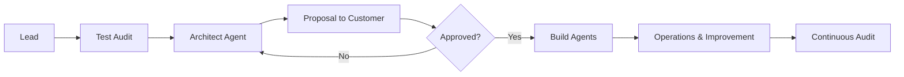

# styde — System Architecture: Brainstorm

> Thoughts from William + Hermes about how the whole system should fit together.
> Built on three pillars: **Consultant Agent → Architect Agent → Agent Wardrobe**.

---

## 1. Flow: Lead → Audit → Proposal → Build → Operations



---

## 2. The Consultant Agent (The Analyzer)

Test audit as preparation — scans the company's website, clarifies needs.

### 2.1 Test Audit (Pre-sale)

| Phase | What | Tools |
|-------|------|-------|
| 1. Crawl | Scan the entire website | Web-scraper / Firecrawl / sitemap |
| 2. Classify | Identify industry, size, IT needs | LLM + classification prompt |
| 3. Diagnostics | Find bottlenecks: manual processes, FAQs, repetitive tasks | Pattern matching + RAG |
| 4. RAG Enrichment | Look up industry-specific knowledge from our database | Vector database (Pinecone/Qdrant) |
| 5. Output | Structured report: "Here's what you can automate" | Report template |

### 2.2 Full Audit (Post-sale, Deeper)

Steps beyond test audit:
- Interview staff (via chat/meet)
- Analyze internal documents, process descriptions
- Connect to Fortnox/Google Workspace/CRM (read-only)
- Map all repetitive tasks
- Prioritize: what gives the most ROI first?

### 2.3 Output Format

```yaml
audit:
  company: "Example AB"
  industry: "accounting"
  size: 12 employees
  test_audit_results:
    - process: "invoice handling"
      time_per_week: "8h"
      automation_potential: "high"
      priority: 1
    - process: "customer support email"
      time_per_week: "5h"
      automation_potential: "medium"
      priority: 2
  recommended_agents:
    - type: "invoice-reviewer"
      tools: ["fortnox", "email"]
    - type: "customer-service-triage"
      tools: ["email", "slack", "knowledge-base"]
```

---

## 3. The Architect Agent

The brain of the system. Creates agents on an assembly line.

### 3.1 Prompt Engineering on the Fly

The Architect writes unique system prompts for each new agent based on:
1. Audit report results
2. Customer's tone-of-voice (extracted from website/existing material)
3. Which tools the agent may use
4. Security restrictions per customer

**Example:** The customer needs a customer service agent:
```
System prompt (generated by the Architect):
You are a customer service agent for [Company].
Your tone-of-voice: [extracted from website and existing communication].
You have access to: [email], [knowledge-base RAG], [order history].
You must NEVER: disclose internal pricing, promise guarantees, share customer data between cases.
```

### 3.2 Orchestration — The Proposal to the Customer

The Architect builds a structured proposal:

> "Based on your analysis I recommend:"
> - **Agent A** (Support triage) — handles 80% of incoming support cases
> - **Agent B** (Invoice reviewer) — automates invoice processing
>
> **Cost:** 4,900 SEK/month + 1,900 SEK/month per additional agent
> **Time savings:** ~13 hours/week (~65,000 SEK/month in saved labor)

### 3.3 The Architect's Toolbox

| Tool | Purpose |
|------|---------|
| Prompt Library | Templates for common agent types (support, invoice, mail, triage) |
| Tone-of-voice Extractor | LLM prompt that reads customer material and extracts voice |
| Tool Mapper | Matches audit results → available tools |
| Cost Calculator | Calculates monthly cost based on agents + tools |
| Blueprint Selector | Selects the right blueprint from the Agent Wardrobe |

---

## 4. The Agent Wardrobe

The library of ready-made agent blueprints. Each blueprint is a template the Architect customizes per customer.

### 4.1 Blueprint Structure

```
agent-blueprints/
├── customer-service-triage/
│   ├── blueprint.yaml        ← Metadata: name, version, cost, time savings
│   ├── prompt_template.md    ← Template the Architect fills in
│   ├── tools.yaml            ← Available tools (email, knowledge base, CRM)
│   └── tests/
│       ├── input.json
│       └── expected.json
├── invoice-reviewer/
│   ├── blueprint.yaml
│   ├── prompt_template.md
│   ├── tools.yaml            ← Fortnox, email, rules
│   └── tests/
├── mail-sorter/
│   ├── ...
├── report-writer/
│   ├── ...
└── calendar-assistant/
    ├── ...
```

### 4.2 Blueprint Metadata

```yaml
# example: agent-blueprints/customer-service-triage/blueprint.yaml
name: customer-service-triage
version: 1.0.0
category: support
cost_per_month: 1900
time_savings_hours_week: 5-8
requirements:
  - email access
  - knowledge base (RAG)
  - order history (read-only)
security_level: medium
tone_of_voice_required: true  # The Architect must extract ToV
```

### 4.3 Skills

Each agent has a set of skills it can use:

| Skill | Description | Used by |
|-------|-------------|---------|
| email-read | Reads and classifies incoming emails | customer-service-triage, mail-sorter |
| email-reply | Writes replies based on templates and RAG | customer-service-triage |
| invoice-read | Interprets PDF invoices and extracts data | invoice-reviewer |
| invoice-validate | Compares against orders, flags deviations | invoice-reviewer |
| calendar-read | Reads availability and books times | calendar-assistant |
| report-write | Generates structured reports | report-writer |
| triage-classify | Categorizes cases by urgency/type | customer-service-triage |

---

## 5. Security & Data Separation (CRITICAL)

> Customer A's agents must under no circumstances have access to Customer B's data.

### 5.1 Architectural Principles

```
┌─────────────────────┐     ┌─────────────────────┐
│  Customer A         │     │  Customer B         │
│                     │     │                     │
│  Agent A1 ─── RAG A │     │  Agent B1 ─── RAG B │
│  Agent A2 ─── RAG A │     │  Agent B2 ─── RAG B │
│                     │     │                     │
│  key_A              │     │  key_B              │
└────────┬────────────┘     └────────┬────────────┘
         │                          │
         └──────────┬───────────────┘
                    │
         ┌──────────▼───────────────┐
         │  Gateway / Control Layer │
         │  - Authentication        │
         │  - Rate limiting         │
         │  - Audit log             │
         └──────────────────────────┘
```

### 5.2 Implementation

| Layer | Mechanism |
|-------|-----------|
| **Vector Database** | Separate Pinecone namespaces per customer. One key per namespace. |
| **Encryption** | Unique encryption key per customer. Data encrypted at rest and in transit. |
| **API Keys** | Per customer, per agent. Rotatable. Individually revocable. |
| **Session/Runtime** | Each agent runs in isolated scope (e.g. own process/container/lambda). |
| **Prompt Injection** | Strict input sanitization. The agent cannot read outside its namespace. |
| **Audit Log** | Every call logged with customer ID, agent ID, timestamp, token count. |
| **Rate Limiting** | Per customer, not per agent. A customer cannot DDoS themselves. |

### 5.3 Separation Rules (HARD-GATE)

1. An agent may only have ONE customer's data in its context
2. Customer A's RAG index is physically separated from Customer B's
3. No agent has a "bypass" to read other customers' data
4. Every agent's system prompt contains explicit restrictions
5. All communication between layers is logged and audited

---

## 6. Improvement Loops

The system should get better over time — automatically.

### 6.1 Micro-loop (Per Agent)

```
Agent runs task → logged → evaluated → improved → new version
```

- **Evaluation:** The user can give thumbs up/down. Automatic detection: retries, timeouts, incorrect answers.
- **Improvement:** On error patterns → the Architect adjusts the prompt → new version deployed.

### 6.2 Macro-loop (Per Customer)

```
Monthly: Architect reviews all agents' performance
→ Recommends new agents or adjustments
→ Proposal to customer
→ Upon approval: build + deploy
```

### 6.3 System-loop (Across All Customers)

```
Quarterly: Review all agent blueprints
→ Which blueprints are used most?
→ Which skills are missing?
→ Update the Agent Wardrobe
→ Create new blueprints for recurring patterns
```

---

## 7. Next Steps (To Build)

| Prio | What | Description |
|------|------|-------------|
| P0 | **Consultant Agent (test audit)** | Crawl website → classify → diagnostics → report |
| P0 | **Agent Wardrobe Structure** | Folder structure + 2-3 first blueprints (customer-service-triage, invoice-reviewer, mail-sorter) |
| P1 | **Architect Agent** | Read audit → match blueprints → generate prompt → build proposal |
| P1 | **Security Layer** | Separate Pinecone namespaces, API key management, audit log |
| P2 | **Improvement Loops** | Auto-evaluation, prompt adjustment, version management |
| P2 | **Dashboard for Customer** | See agent status, statistics, time saved |

---

## Comments

- 2026-06-25 | hermes: First brainstorm. Captures William's vision of the Consultant Agent, Architect Agent, Agent Wardrobe, security separation, and improvement loops.

> *Translated from Swedish to English by Hermes on 2026-06-25.*
