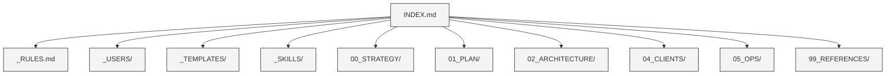

# INDEX — styde Planeringshubben

> [!note] Planeringshubben
> Detta är hjärtat av styde. All planering, strategi och arkitektur finns här.
> Varje bot som kliver in läser först [[_RULES]].
> Senast uppdaterad: 2026-06-24

## Huvuddokument

- [[MASTER_PLAN_FINAL]] (rotnivå) — Den fullständiga, bot-granskade masterplanen. Allt som står där är beslutat och gäller.

## Innehållsstruktur

| Sökväg / Fil | Beskrivning | Ansvarig |
|--------------|-------------|-----------|
| [[_RULES]] | Bot-regler, taggar, format | LÄS FÖRST |
| [[_USERS/_README\|_USERS/]] | Personprofiler för teamet | Alla |
| [[_TEMPLATES/_README\|_TEMPLATES/]] | Mallar för planer och agendor | Alla |
| [[_SKILLS/_README\|_SKILLS/]] | Obsidian-specifika skills | Alla |
| `00_STRATEGY/` | Business, marknad, erbjudande | William |
| - [[BUSINESS_CONCEPT]] | Affärskoncept | William |
| - [[MARKET]] | Marknadsanalys | William |
| - [[OFFER]] | Tjänstepaket | William |
| - [[PRICING_MODEL]] | Prismodell | William |
| `01_PLAN/` | Roadmaps och sprintar | Hermes |
| - [[ROADMAP]] | Roadmap och faser | William |
| `02_ARCHITECTURE/` | Systemarkitektur och specar | William + Hermes |
| - [[SYSTEM_OVERVIEW]] | Systemöversikt | William |
| - [[DASHBOARD_SPEC]] | Dashboard specifikation | William |
| - [[AGENT_FRAMEWORK]] | Agent-ramverk specifikation | William |
| `03_PROTOTYPES/` | Experiment, mockups och kod | William |
| `04_CLIENTS/` | Kundarbete och mallar | Alla |
| - [[AUDIT_TEMPLATE]] | Mall för audit-rapport | Alpedal |
| - [[OFFERT_TEMPLATE]] | Mall för offert | William |
| `05_OPS/` | Drift, subscription, processer | William + Hermes |
| - [[ONBOARDING]] | Kund-onboardingprocess | William |
| - [[SUBSCRIPTION_TIERS]] | Subscription-nivåer | William |
| `99_REFERENCES/` | Research och länkar | Alla |
| - [[LINKS]] | Referenslänkar | Alla |

## För nya i teamet

1. Läs `.agents/AGENTS.md` — Den pekar hit.
2. Läs [[_RULES]] — Bot-regler och format.
3. Läs din profil under [[_USERS/_README|_USERS/]] — Din roll och ditt ansvar.
4. Läs [[MASTER_PLAN_FINAL]] (rotnivå) — Hela planen.
5. Börja arbeta.

## Kommentarer

- 2026-06-24 | hermes: Uppdaterad med wikilinks, callouts, och Mermaid-diagram för mappstruktur.
